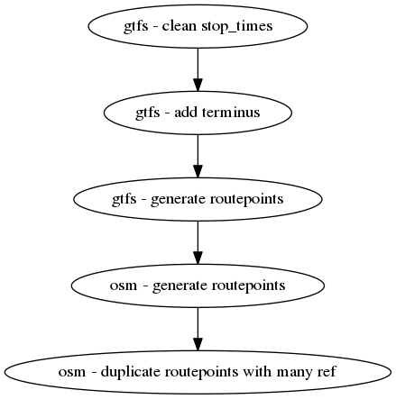

# Audit comparatif OSM / STIF

Ce répertoire contient le code, ainsi que les sauvegardes de données pour réaliser les audits comparatifs entre les données OSM et les données opendata du STIF.

En particulier, afin de gommer les divergences de modélisation, on travaillera sur des routepoints en complément des arrêts ; Un routepoint est un object logique qui représente un arrêt desservi par une ligne dans une direction.

Ces routepoints sont précalculés à partir des données OSM et GTFS à l'aide du factfile.

# Audits

Les audits produits sont publiés sur le site de Jungle Bus. Une sauvegarde pdf, ainsi que les données et les images produites sont également disponibles dans ce répertoire.

Le code est présent dans des notebooks en complément des étapes de préprocess détaillées dans le factfile. Pour accéder au code d'un audit en particulier, utiliser le tag git correspondant.

* Audit d'avril 2018 - [Publication](http://junglebus.io/iledefrance/audit_2018_04) - tag [audit_2018_04](https://github.com/Jungle-Bus/ref-fr-STIF/tree/audit_2018_04)
* Audit de juillet 2018 - [Publication](http://junglebus.io/iledefrance/audit_2018_07) - tag [audit_2018_07](https://github.com/Jungle-Bus/ref-fr-STIF/tree/audit_2018_07)
* Audit de novembre 2018 - [Publication](http://junglebus.io/iledefrance/audit_2018_11) - tag [audit_2018_11](https://github.com/Jungle-Bus/ref-fr-STIF/tree/audit_2018_11)
* Audit de février 2019 - [Publication](http://junglebus.io/iledefrance/audit_2019_02) - tag [audit_2019_02](https://github.com/Jungle-Bus/ref-fr-STIF/tree/audit_2019_02)

# Lancement

L'audit utilise pipenv pour gérer ses dépendances. Il faut l'initialiser avec un `pipenv install`

Pour naviguer dans les notebook de l'audit : `pipenv run jupyter notebook`

Ne pas oublier de modifier les répertoires d'entrée et de sortie en fonction du cas d'usage.

NB: Si l'erreur `Could not find libspatialindex_c library file` se produit, installer le package libspatialindex-dev :  `apt install libspatialindex-dev`
