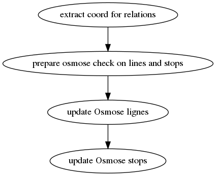

# Analyse Osmose spécifiques à l'Île-de-France et au référentiel STIF
Des analyses Osmose sont disponibles pour vérifier la cohérence du référentiel STIF dans OSM (code inexistant, codes en doublons, etc) et proposer des améliorations sur la base des informations disponibles dans l'opendata STIF

http://osmose.openstreetmap.fr/fr/errors/?country=france_ile_de_france&item=8042

Pour générer les analyses Osmose, il faut au préalable
* des données OSM. En particulier, les lignes doivent être filtrées pour ne conserver que celles qui sont susceptibles d'avoir un code STIF (voir ref-lignes-stif)
* des données opendata STIF

La clef d'authentification nécessaire pour l'envoi des erreurs au front Osmose (de dev et de prod) doit être configurée en variable d'environnement (`export Osmose_idf_auth='my_very_own_Osmose_auth_key'`)
